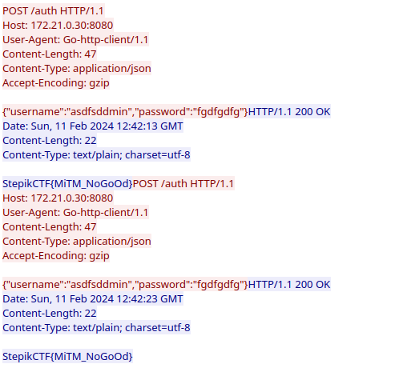

# Решение задачи 'MITM'

Использовать буду задачу запущенную локально. (172.21.0.30:8080)

Бинарные файлы можно скачать 

Используем программу wireshark

Из интерфейсов я выбрал все и поставил фильтр `http`

После запуска бинарного файла появились запросы. 

Правой кнопкой мыши на запрос > Отслеживать > http Stream 

После открытия окна вижу флаг.

